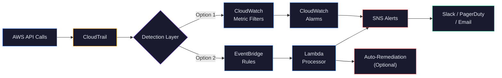

# AWS CloudTrail Detection Rules

Production-ready detection rules for AWS security monitoring. 25 rules targeting the attack patterns behind the majority of cloud breaches — IAM privilege escalation, data exfiltration, logging tampering, and defense evasion.

Built by [Adewale Odeja](https://linkedin.com/in/adewaleodeja), ACRTP-certified Cloud Security Engineer.

---

## Architecture



**Two deployment paths, same detection logic.** CloudWatch Metric Filters for cost-effective monitoring (~$0.30/filter/month). EventBridge Rules for near real-time detection (seconds vs minutes). Both deploy via Terraform.

---

## Why These Rules Exist

The attack patterns detected by this library are responsible for the majority of AWS security incidents reported publicly:

- **IAM privilege escalation** is the #1 post-compromise technique in cloud breaches. Attackers with limited access exploit overly permissive IAM policies to grant themselves admin — often in a single API call.
- **CloudTrail tampering** is present in the majority of sophisticated AWS intrusions. Attackers disable logging before lateral movement, creating blind spots that delay detection by hours or days.
- **S3 data exposure** remains the most common cloud data breach vector. Misconfigured bucket policies and ACLs have caused billions in damages across every industry.
- **Encryption key deletion** and **GuardDuty disabling** are defense evasion techniques that attackers use to prevent forensic analysis and automated alerting after initial compromise.

These rules detect the specific CloudTrail API calls that precede data breaches — not generic anomalies, but the exact events that real attackers generate.

### Business Value

- **Audit-ready:** Each rule maps to PCI DSS, SOC 2, HIPAA, and CIS AWS Foundations controls — evidence your auditor can reference directly.
- **Tuned for production:** False positive guidance and exclusion patterns are included for every rule, because untuned detection rules become noise that teams ignore.
- **Deploy in minutes:** Terraform modules for both CloudWatch and EventBridge. Run `terraform apply` and your environment is monitored.
- **Offensive-informed:** Every detection was built by studying the attack technique first (ACRTP methodology), then writing the rule that catches it.

---

## Detection Coverage

| Category | Rules | Description | Deep-Dive |
| --- | --- | --- | --- |
| IAM Privilege Escalation | 5 | Self-escalation, credential abuse, policy manipulation | [IAM-001](docs/IAM-001-privilege-escalation.md) |
| Unusual Access Patterns | 5 | Root activity, MFA bypass, brute force attempts | — |
| Data Exfiltration | 5 | Public S3 buckets, snapshot sharing, data exposure | [EXFIL-001](docs/EXFIL-001-s3-data-exposure.md) |
| Security Group Changes | 3 | Network exposure, 0.0.0.0/0 access | — |
| Encryption Changes | 3 | KMS deletion, encryption removal | — |
| Logging Tampering | 4 | CloudTrail/GuardDuty disabling | [LOG-001](docs/LOG-001-cloudtrail-tamper.md) |

**25 rules total** across 6 categories. Each rule includes detection logic, MITRE ATT&CK mapping, compliance references, false positive guidance, and a response playbook.

### MITRE ATT&CK for Cloud Coverage

See [MITRE_COVERAGE.md](docs/MITRE_COVERAGE.md) for the full coverage matrix, including which techniques are detected and which gaps remain on the roadmap.

| Tactic | Techniques Covered | Coverage |
| --- | --- | --- |
| Privilege Escalation | 5 of 6 | ██████████░ 83% |
| Exfiltration | 5 of 5 | ███████████ 100% |
| Defense Evasion | 4 of 7 | ████████░░░ 57% |
| Impact | 3 of 4 | █████████░░ 75% |
| Credential Access | 2 of 4 | █████░░░░░░ 50% |
| Initial Access | 1 of 4 | ███░░░░░░░░ 25% |
| Discovery | 0 of 5 | ░░░░░░░░░░░ 0% |
| Lateral Movement | 0 of 3 | ░░░░░░░░░░░ 0% |

---

## Quick Start

### Option 1: CloudWatch Metric Filters (Recommended for most environments)

```bash
cd cloudwatch
terraform init
terraform plan
terraform apply
```

### Option 2: EventBridge Rules (Near real-time detection)

```bash
cd eventbridge
terraform init
terraform plan
terraform apply
```

### Prerequisites

- AWS account with CloudTrail enabled (multi-region trail recommended)
- Terraform >= 1.0
- IAM permissions to create CloudWatch Metric Filters, Alarms, EventBridge Rules, and SNS Topics
- An SNS Topic ARN for alert delivery

---

## Detection Categories

### 1. IAM Privilege Escalation

Detects attempts to gain elevated permissions within AWS accounts.

| Rule | Severity | MITRE ATT&CK |
| --- | --- | --- |
| Self-Escalation via Inline Policy | Critical | T1098.001 |
| Cross-Identity Access Key Creation | High | T1098.001 |
| Administrative Policy Attachment | Critical | T1098.001 |
| Policy Version Escalation | High | T1098.001 |
| Console Access Created | Medium | T1136.003 |

> **Deep-dive:** [IAM-001 — Privilege Escalation Detection](docs/IAM-001-privilege-escalation.md) — full attack scenario, CloudTrail evidence, detection logic, and response playbook.

### 2. Unusual Access Patterns

Detects suspicious authentication and access behaviors.

| Rule | Severity | MITRE ATT&CK |
| --- | --- | --- |
| Root Account API Activity | High | T1078.004 |
| Console Login Without MFA | High | T1078.004 |
| Root Console Login | High | T1078.004 |
| Multiple Failed Login Attempts | High | T1110.001 |
| Unauthorized API Calls | Medium | T1078 |

### 3. Data Exfiltration

Detects attempts to expose or extract data from AWS resources.

| Rule | Severity | MITRE ATT&CK |
| --- | --- | --- |
| S3 Bucket Policy Allows Public Access | Critical | T1537 |
| S3 Bucket ACL Grants Public Access | Critical | T1537 |
| EBS Snapshot Shared Externally | Critical | T1537 |
| AMI Shared Publicly | High | T1537 |
| RDS Snapshot Shared | Critical | T1537 |

> **Deep-dive:** [EXFIL-001 — S3 Data Exposure Detection](docs/EXFIL-001-s3-data-exposure.md) — full attack scenario, CloudTrail evidence, detection logic, and response playbook.

### 4. Security Group Changes

Detects network security modifications that could expose resources.

| Rule | Severity | MITRE ATT&CK |
| --- | --- | --- |
| Security Group Open to Internet | Critical | T1562.007 |
| Security Group Allows All Traffic | Critical | T1562.007 |
| Security Group Deleted | Medium | T1562.007 |

### 5. Encryption Changes

Detects modifications to encryption configurations.

| Rule | Severity | MITRE ATT&CK |
| --- | --- | --- |
| KMS Key Scheduled for Deletion | Critical | T1485 |
| KMS Key Disabled | High | T1485 |
| S3 Bucket Encryption Removed | High | T1485 |

### 6. Logging Tampering

Detects attempts to disable security monitoring (highest priority).

| Rule | Severity | MITRE ATT&CK |
| --- | --- | --- |
| CloudTrail Logging Stopped | Critical | T1562.008 |
| CloudTrail Trail Deleted | Critical | T1562.008 |
| CloudTrail Configuration Changed | High | T1562.008 |
| GuardDuty Detector Deleted | Critical | T1562.008 |

> **Deep-dive:** [LOG-001 — CloudTrail Tamper Detection](docs/LOG-001-cloudtrail-tamper.md) — full attack scenario, CloudTrail evidence, detection logic, and response playbook.

---

## Rule Format

Each rule is defined in JSON with the following structure:

```json
{
  "id": "IAM-001",
  "name": "Self-Escalation via Inline Policy",
  "description": "Detects when a user attaches an inline policy with wildcard permissions to themselves",
  "severity": "Critical",
  "mitre_attack": {
    "tactic": "Privilege Escalation",
    "technique": "T1098.001",
    "technique_name": "Account Manipulation: Additional Cloud Credentials"
  },
  "detection": {
    "eventSource": "iam.amazonaws.com",
    "eventName": ["PutUserPolicy", "PutRolePolicy"],
    "conditions": "userIdentity.userName == requestParameters.userName AND policyDocument contains Action:*"
  },
  "cloudwatch_filter_pattern": "{ ($.eventSource = \"iam.amazonaws.com\") && (($.eventName = \"PutUserPolicy\") || ($.eventName = \"PutRolePolicy\")) }",
  "false_positives": [
    "Terraform or CloudFormation automation creating resources",
    "Authorized administrators updating their own policies"
  ],
  "tuning_guidance": "Exclude known automation roles by adding: && ($.userIdentity.userName != \"terraform-runner\")",
  "response": [
    "Identify the user and source IP from the CloudTrail event",
    "Review the policy document for unauthorized permissions",
    "If unauthorized, revoke the policy immediately",
    "Investigate how the user obtained iam:PutUserPolicy permission"
  ],
  "compliance": {
    "pci_dss": ["7.1", "7.2"],
    "soc2": ["CC6.1"],
    "hipaa": ["164.312(a)(1)"],
    "cis_aws": ["1.16"]
  }
}
```

---

## Compliance Mapping

| Framework | Covered Requirements |
| --- | --- |
| PCI DSS | 1.3, 3.4, 3.5, 7.1, 7.2, 8.1, 8.3, 10.2, 10.5, 10.7 |
| SOC 2 | CC6.1, CC6.2, CC6.6, CC6.8, CC7.2, CC8.1 |
| HIPAA | 164.312(a)(1), 164.312(b), 164.312(d), 164.312(e)(1) |
| CIS AWS | 1.7, 1.16, 2.1.1, 2.1.5, 3.1, 3.2, 3.3, 4.1–4.15 |

See [COMPLIANCE_MAPPING.md](docs/COMPLIANCE_MAPPING.md) for the detailed requirement-to-rule mapping.

---

## Tuning for Your Environment

Detection rules will generate false positives in most environments. Common sources:

| Rule Category | Common False Positive | Tuning Approach |
| --- | --- | --- |
| IAM Changes | Terraform automation | Exclude `terraform-runner` user |
| Security Groups | CI/CD pipelines | Exclude automation roles |
| Root Activity | Break-glass procedures | Whitelist specific times/IPs |
| Console Login | Service accounts | Exclude programmatic users |

See individual rule files in `rules/` for specific tuning guidance per detection.

---

## Deployment Options

### CloudWatch Metric Filters + Alarms

Best for: Most AWS environments, native integration, low cost (~$0.30/filter/month).

```hcl
module "detection_rules" {
  source = "./cloudwatch"

  cloudtrail_log_group = "/aws/cloudtrail/main"
  sns_topic_arn        = aws_sns_topic.security_alerts.arn
}
```

### EventBridge Rules

Best for: Near real-time detection (seconds vs minutes), complex routing, Lambda-based auto-remediation.

```hcl
module "detection_rules" {
  source = "./eventbridge"

  sns_topic_arn = aws_sns_topic.security_alerts.arn
}
```

---

## Roadmap

- [ ] Discovery tactic detections (DescribeInstances enumeration, GetCallerIdentity frequency)
- [ ] Lateral movement detections (cross-account AssumeRole chains)
- [ ] Lambda-based auto-remediation modules for critical findings
- [ ] Sigma rule format export for SIEM integration
- [ ] Cost estimation calculator per deployment option
- [ ] Additional compliance mappings (NIST 800-53, FedRAMP)

---

## Contributing

Contributions welcome. Please include:

- Detection logic with CloudTrail field references
- MITRE ATT&CK mapping
- False positive guidance
- Compliance mapping where applicable

---

## Author

**Adewale Odeja**
Cloud Security Engineer | AWS Threat Detection & Automation | ACRTP Certified

- LinkedIn: [linkedin.com/in/adewaleodeja](https://linkedin.com/in/adewaleodeja)
- GitHub: [github.com/Walentino](https://github.com/Walentino)
- Portfolio: [walentino.github.io/signalroot](https://walentino.github.io/signalroot.github.io/)

---

## License

MIT License — See [LICENSE](LICENSE) for details.
